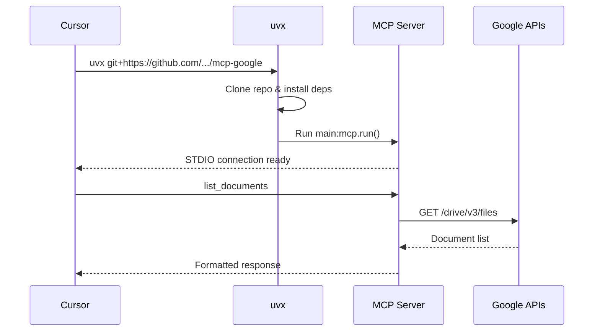

# Google Docs MCP Server

An MCP (Model Context Protocol) server implementation for Google Docs integration, enabling AI assistants to interact with Google Docs through standardized tools.

## Features

This MCP server provides comprehensive tools for Google Docs operations:

- **list_documents**: List all Google Docs documents in your Google Drive
- **get_document**: Get detailed content and structure of a document
- **create_document**: Create a new Google Docs document
- **insert_text**: Insert text at any position in a document
- **replace_text**: Find and replace text throughout a document
- **format_text**: Apply bold, italic, or underline formatting
- **insert_image**: Insert images from URLs
- **export_document**: Export documents in multiple formats (PDF, DOCX, etc.)
- **delete_document**: Delete (trash) a document

## Prerequisites

- Python 3.13+
- Google account with API access
- Google OAuth 2.0 access token with appropriate scopes

### Required Google API Scopes

Your OAuth token must have the following scopes:
- `https://www.googleapis.com/auth/documents` - For Google Docs operations
- `https://www.googleapis.com/auth/drive.file` - For file management

## Installation

### Method 1: Direct Installation

1. Clone this repository:
```bash
git clone <repository-url>
cd mcp-google
```

2. Create and activate a virtual environment using uv:
```bash
uv venv
source .venv/bin/activate  # On Unix/macOS
# or
.venv\Scripts\activate     # On Windows
```

3. Install dependencies:
```bash
uv pip install -e .
```

### Method 2: Using uvx (Recommended for Cursor/Claude Desktop)

No installation needed! Use directly with:
```bash
uvx git+https://github.com/your-username/mcp-google
```

## Configuration

### Getting Google OAuth Access Token

You need to obtain a Google OAuth 2.0 access token. Here are several methods:

#### Option 1: Using Google OAuth 2.0 Playground (Quick Testing)

1. Go to [Google OAuth 2.0 Playground](https://developers.google.com/oauthplayground/)
2. Click the gear icon (⚙️) in top right, check "Use your own OAuth credentials"
3. Enter your OAuth Client ID and Secret (from Google Cloud Console)
4. In Step 1, select these scopes:
   - `https://www.googleapis.com/auth/documents`
   - `https://www.googleapis.com/auth/drive.file`
5. Click "Authorize APIs"
6. In Step 2, click "Exchange authorization code for tokens"
7. Copy the **Access token** (note: it expires in ~1 hour)

#### Option 2: Using OpenManus OAuth Integration (Recommended for Production)

If you're using the OpenManus platform (from the attached files), it already has Google OAuth integration built-in. The access token is automatically managed.

#### Option 3: Create Your Own OAuth Flow

1. Go to [Google Cloud Console](https://console.cloud.google.com/)
2. Create a new project or select existing one
3. Enable Google Docs API and Google Drive API
4. Create OAuth 2.0 credentials (Desktop app or Web app)
5. Implement OAuth flow in your application
6. Store refresh token for long-term access

### Environment Configuration

1. Copy the example environment file:
```bash
cp .env.example .env
```

2. Edit `.env` and add your access token:
```env
GOOGLE_ACCESS_TOKEN=your_actual_access_token_here
```

**Important**: The access token expires after a short period (usually 1 hour). For production use, implement token refresh logic or use a service like OpenManus that manages tokens automatically.

## Usage

### Running the Server

Start the MCP server using one of the following methods:

```bash
# Method 1: Run directly with Python
python main.py

# Method 2: Use the installed command
mcp-google-docs

# Method 3: Run with uv (recommended)
uv run mcp-google-docs

# Method 4: Run with uvx (no installation needed)
uvx git+https://github.com/your-username/mcp-google main.py
```

### Testing with MCP Inspector

Test your MCP server interactively:

```bash
# Using installed command
npx @modelcontextprotocol/inspector uv run mcp-google-docs

# Using Python directly
npx @modelcontextprotocol/inspector uv run python main.py

# Using uvx (from git)
npx @modelcontextprotocol/inspector uvx git+https://github.com/your-username/mcp-google
```

### Adding to Claude Desktop or Cursor

Add the following to your MCP configuration:

**Using Local Installation:**

```json
{
  "mcpServers": {
    "google-docs": {
      "command": "uv",
      "args": [
        "--directory",
        "/absolute/path/to/mcp-google",
        "run",
        "mcp-google-docs"
      ]
    }
  }
}
```

**Using uvx (Direct from Git - Recommended):**

```json
{
  "mcpServers": {
    "google-docs": {
      "command": "uvx",
      "args": [
        "git+https://github.com/your-username/mcp-google"
      ],
      "env": {
        "GOOGLE_ACCESS_TOKEN": "your_access_token_here"
      }
    }
  }
}
```

**Config File Locations:**
- **MacOS/Cursor**: `~/Library/Application Support/Cursor/mcp.json`
- **MacOS/Claude Desktop**: `~/Library/Application Support/Claude/claude_desktop_config.json`
- **Windows**: `%APPDATA%/Claude/claude_desktop_config.json`

## Available Tools

### 1. list_documents

List all Google Docs documents in your Google Drive.

**Parameters:**
- `max_results` (integer, optional): Maximum number of documents to return (default: 10, max: 1000)

**Returns:**
```json
{
  "files": [
    {
      "id": "document-id",
      "name": "Document Name",
      "createdTime": "2024-01-01T00:00:00Z",
      "modifiedTime": "2024-01-02T00:00:00Z",
      "webViewLink": "https://docs.google.com/document/d/..."
    }
  ],
  "count": 5,
  "message": "Successfully listed 5 documents"
}
```

### 2. get_document

Get detailed content and structure of a Google Docs document.

**Parameters:**
- `document_id` (string, required): The Google Docs document ID

**Returns:**
```json
{
  "documentId": "document-id",
  "title": "Document Title",
  "body": {
    "content": [...]
  },
  "message": "Successfully retrieved document: Document Title"
}
```

### 3. create_document

Create a new Google Docs document.

**Parameters:**
- `title` (string, required): Title for the new document

**Returns:**
```json
{
  "documentId": "new-document-id",
  "title": "New Document",
  "webViewLink": "https://docs.google.com/document/d/...",
  "message": "Successfully created document: New Document"
}
```

### 4. insert_text

Insert text into a document at specified position.

**Parameters:**
- `document_id` (string, required): The Google Docs document ID
- `text` (string, required): Text content to insert
- `index` (integer, optional): Position to insert text (default: 1)

**Example:**
```python
# Insert "Hello World" at the beginning of document
insert_text(document_id="abc123", text="Hello World\n", index=1)
```

### 5. replace_text

Replace all occurrences of text in a document.

**Parameters:**
- `document_id` (string, required): The Google Docs document ID
- `old_text` (string, required): Text to find and replace
- `new_text` (string, required): Replacement text

**Example:**
```python
# Replace all "old" with "new"
replace_text(document_id="abc123", old_text="old", new_text="new")
```

### 6. format_text

Apply formatting to text in a document.

**Parameters:**
- `document_id` (string, required): The Google Docs document ID
- `start_index` (integer, required): Start position of text to format
- `end_index` (integer, required): End position of text to format
- `bold` (boolean, optional): Make text bold
- `italic` (boolean, optional): Make text italic
- `underline` (boolean, optional): Make text underlined

**Example:**
```python
# Make text from position 1 to 10 bold and italic
format_text(document_id="abc123", start_index=1, end_index=10, bold=True, italic=True)
```

### 7. insert_image

Insert an image into a document.

**Parameters:**
- `document_id` (string, required): The Google Docs document ID
- `image_url` (string, required): Publicly accessible URL of the image
- `index` (integer, optional): Position to insert image (default: 1)

**Example:**
```python
# Insert image at beginning of document
insert_image(document_id="abc123", image_url="https://example.com/image.png", index=1)
```

### 8. export_document

Export a document to specified format.

**Parameters:**
- `document_id` (string, required): The Google Docs document ID
- `export_format` (string, optional): Export format (default: "pdf")
  - Supported: pdf, docx, odt, rtf, txt, html, epub

**Example:**
```python
# Export document as PDF
export_document(document_id="abc123", export_format="pdf")
```

### 9. delete_document

Delete (trash) a Google Docs document.

**Parameters:**
- `document_id` (string, required): The Google Docs document ID to delete

**Example:**
```python
# Delete document
delete_document(document_id="abc123")
```

## Project Structure

```
mcp-google/
├── main.py              # Main MCP server implementation
├── pyproject.toml       # Project configuration and dependencies
├── .env.example         # Example environment variables
├── .env                 # Your actual credentials (git-ignored)
└── README.md           # This file
```

## Dependencies

- **fastmcp**: Framework for building MCP servers
- **httpx**: Modern HTTP client for API requests
- **python-dotenv**: Load environment variables from .env files

## Architecture

This MCP server follows the same pattern as the Salesforce and Databricks servers:



## Error Handling

The server includes comprehensive error handling:

- **Missing Token**: Clear error message if GOOGLE_ACCESS_TOKEN is not set
- **Authentication Errors**: Token expiration or invalid scope errors are reported
- **API Errors**: Google API errors are caught and returned with helpful messages
- **Rate Limits**: Respects Google API rate limits

## Security Notes

- Never commit your `.env` file to version control
- Keep your Google access token secure
- Use refresh tokens for production deployments
- Regularly rotate your OAuth credentials
- Consider using service accounts for server-to-server applications

## Token Expiration

OAuth access tokens typically expire after 1 hour. For production use:

1. **Implement Token Refresh**: Use refresh tokens to automatically get new access tokens
2. **Use OpenManus**: If you have OpenManus deployed, it handles token refresh automatically
3. **Service Accounts**: For server applications, consider using Google Service Accounts

## Integration with OpenManus

This MCP server can be integrated with the OpenManus platform (from attached files):

1. OpenManus already has Google OAuth flow implemented
2. It manages access tokens and refresh tokens automatically
3. The `GoogleDocsConnector` class in OpenManus can be used as reference
4. Use the same access token from OpenManus in this MCP server

## Troubleshooting

### Token Expired Error

**Error**: `401 Unauthorized` or token expired message

**Solution**: Get a new access token from Google OAuth Playground or implement refresh token logic

### Insufficient Permissions

**Error**: `403 Forbidden` or scope error

**Solution**: Ensure your OAuth token has the required scopes:
- `https://www.googleapis.com/auth/documents`
- `https://www.googleapis.com/auth/drive.file`

### Document Not Found

**Error**: Document ID not found

**Solution**: 
- Verify the document ID is correct
- Ensure the document is accessible with your Google account
- Check if document was deleted or moved

## Development

### Running Tests

```bash
# Install dev dependencies
uv pip install -e ".[dev]"

# Run tests
pytest
```

### Contributing

1. Fork the repository
2. Create a feature branch
3. Make your changes
4. Add tests for new functionality
5. Submit a pull request

## License

[Add your license here]

## Related Projects

- [mcp-salesforce](../mcp-salesforce) - Salesforce MCP Server
- [mcp-databricks](../mcp-databricks) - Databricks MCP Server
- [OpenManus](../OpenManus) - AI-powered data analytics platform with Google integration

## Support

For issues and questions:
- Check the [Google Docs API documentation](https://developers.google.com/docs/api)
- Review [Google OAuth 2.0 documentation](https://developers.google.com/identity/protocols/oauth2)
- Open an issue in this repository

## Acknowledgments

Built with:
- [FastMCP](https://github.com/jlowin/fastmcp) - MCP server framework
- [Google Docs API](https://developers.google.com/docs/api)
- [Google Drive API](https://developers.google.com/drive/api)

